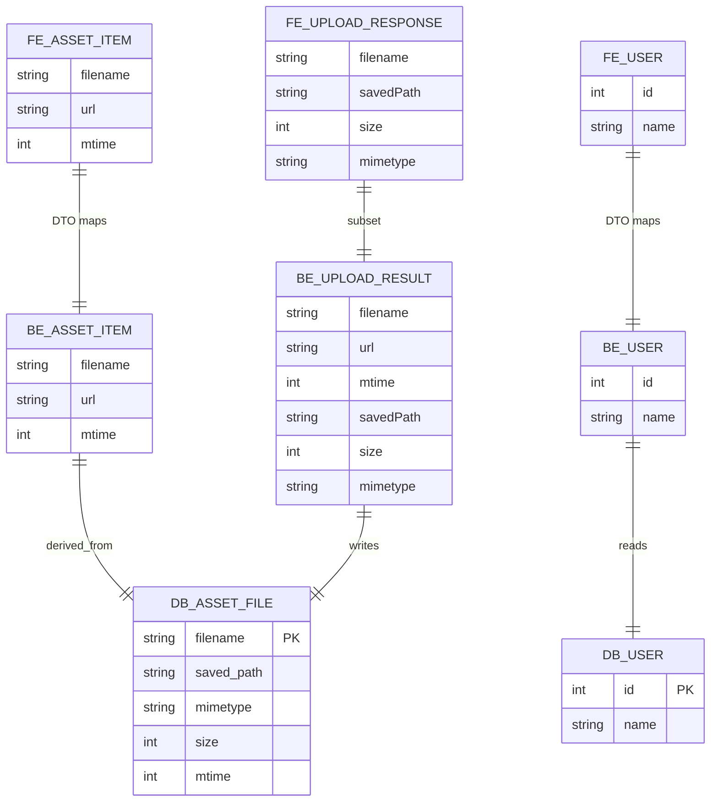
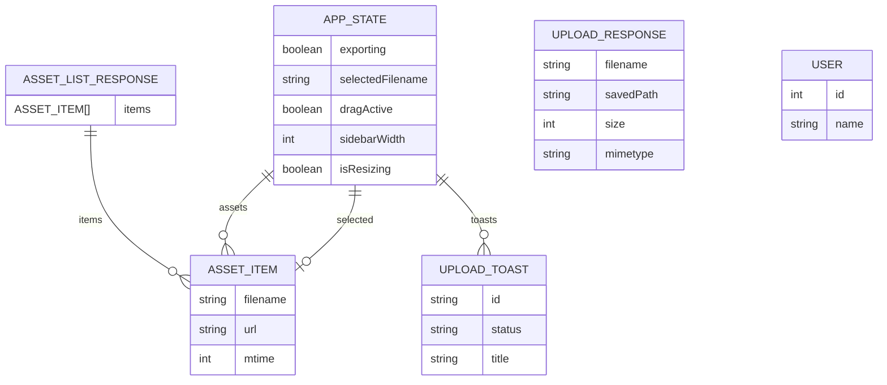
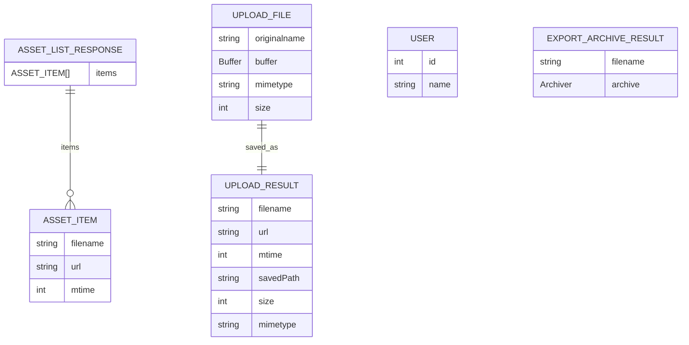
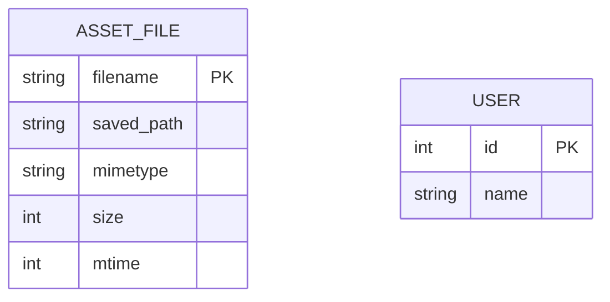

# ER Diagram

## ER-ALL

### Assumptions
- DB_* entities are conceptual because the current implementation uses filesystem storage and in-memory users.
- FE_UPLOAD_RESPONSE is a subset of BE_UPLOAD_RESULT; fields like url and mtime are omitted on the FE type.
- Mappings are based on matching field names between FE/BE and not on a shared DTO source yet.

## ER-FE

### Assumptions
- APP_STATE is inferred from React useState hooks in frontend/src/App.tsx.
- selectedFilename references ASSET_ITEM.filename when not null.

## ER-BE

### Assumptions
- USER is currently returned from an in-memory list in DatabaseService.
- EXPORT_ARCHIVE_RESULT.archive represents a streaming archive object at runtime.

## ER-DB

### Assumptions
- No relational database is implemented yet; ASSET_FILE models filesystem persistence.
- USER table is speculative to reflect the User DTO shape used by the API.
